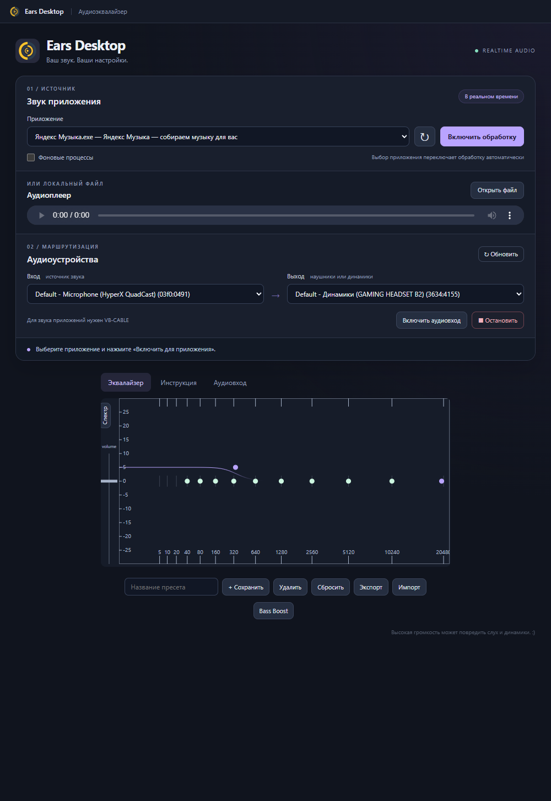
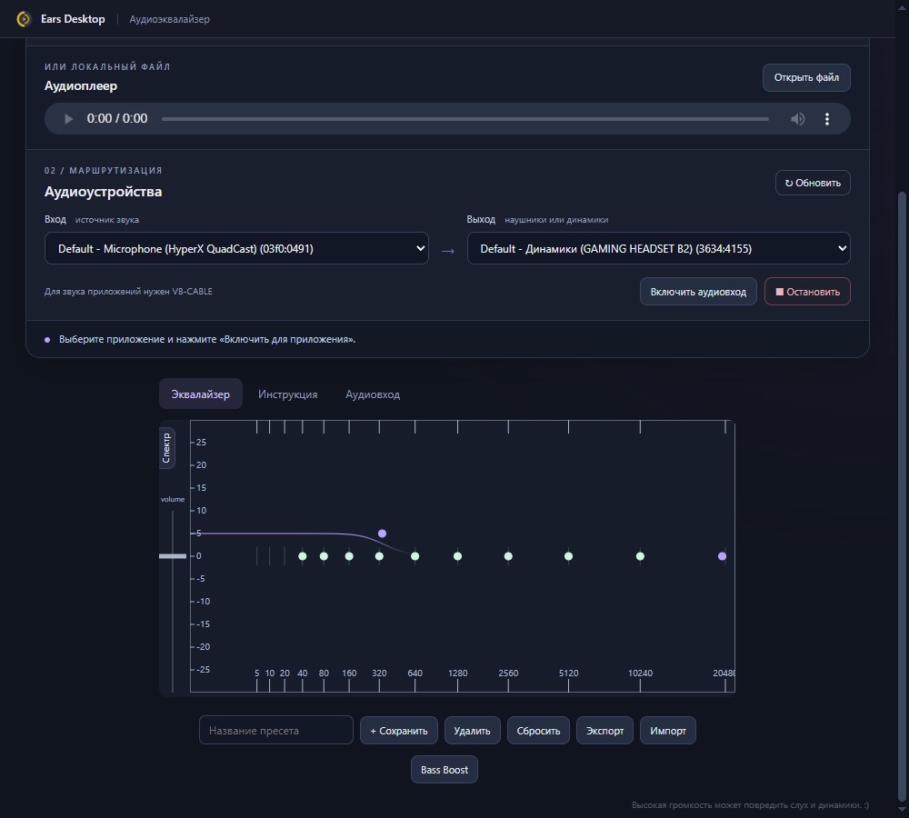

<div align="center">


# Легендарный Ears: Bass Boost, EQ Any Audio!

### ПК-версия для Windows · Ears Desktop

**Любимый эквалайзер — теперь для звука настольных приложений.**

Яндекс Музыка · Spotify · медиаплееры · другие программы Windows


[Быстрый старт](#быстрый-старт) · [Возможности](#возможности) · [Руководство PDF](docs/guide.pdf)



</div>

## Ears выходит за пределы браузера

Браузерная версия Ears обрабатывала звук внутри браузера. **Ears Desktop — отдельное приложение для ПК**, которое позволяет настроить эквалайзер для звука выбранной программы Windows: например, настольной Яндекс Музыки, Spotify или любимого медиаплеера.

Выберите приложение, включите обработку и настройте бас, середину и высокие частоты под свои наушники. Маршрутизация звука приложений работает через **VB-CABLE**. Совместимость зависит от того, как программа выбирает аудиовыход; некоторые приложения требуют перезапуска воспроизведения или ручного выбора CABLE Input.

| | Браузерная версия | Ears Desktop |
|---|---|---|
| Где работает | В браузере | Отдельное приложение Windows |
| Источник звука | Аудио браузера | Выбранная настольная программа |
| Примеры | Музыка и видео в браузере | Яндекс Музыка, Spotify, медиаплееры |
| Настройка | Расширение браузера | Приложение и VB-CABLE |

## Возможности

- **11 полос эквалайзера** с настройкой частоты, усиления и добротности Q.
- **Bass Boost** — готовая настройка для усиления баса.
- **Обработка в реальном времени** и отображение спектра.
- **Выбор программы** из списка открытых приложений и фоновых процессов.
- **Собственные пресеты**, импорт и экспорт в JSON.
- **Встроенный аудиоплеер** для локальных файлов.
- **Выбор входа и выхода**: аудиокабель, микрофон, наушники или динамики.
- **Возврат предыдущего аудиовыхода** выбранного приложения при остановке обработки и штатном закрытии Ears.

<div align="center">

</div>

## Быстрый старт

### 1. Подготовьте Windows

Нужны Windows 10/11 x64, наушники или динамики. Для обработки звука других программ установите [VB-CABLE с официального сайта](https://vb-audio.com/Cable/) и перезагрузите ПК. Для встроенного плеера VB-CABLE не требуется.

### 2. Запустите Ears Desktop

Скачайте архив **Ears-Desktop-1.0.0-Windows-x64.zip** из раздела **Releases** этого репозитория, распакуйте всю папку и запустите `Ears Desktop.exe`. Программа переносимая: сохраняйте EXE вместе с папками `resources`, `locales` и остальными файлами архива.

### 3. Подключите приложение

1. Откройте Яндекс Музыку, Spotify или другую программу и включите воспроизведение.
2. В Ears нажмите кнопку обновления списка приложений и выберите нужную программу. При необходимости включите «Фоновые процессы».
3. В качестве выхода выберите физические наушники или динамики.
4. Нажмите **«Включить обработку»**. Ears направит звук выбранного приложения через VB-CABLE.
5. Нажмите **Bass Boost** или настройте точки эквалайзера вручную. Сохраните результат как свой пресет.

Физические наушники или динамики должны оставаться устройством воспроизведения Windows по умолчанию. Не назначайте CABLE Input системным выходом по умолчанию.

## Как проходит звук


Обрабатывается выбранное приложение. При переключении программы Ears возвращает предыдущую маршрутизацию и подключает новый источник. Для независимой одновременной обработки нескольких программ с разными пресетами эта версия не предназначена.

## Управление эквалайзером

| Действие | Управление |
|---|---|
| Изменить частоту и усиление | Перетащите точку полосы |
| Изменить добротность Q | Удерживайте Shift и перемещайте точку по вертикали |
| Изменить общую громкость | Переместите регулятор Volume слева |
| Усилить бас | Нажмите Bass Boost |
| Сохранить настройки | Введите название пресета и нажмите «Сохранить» |
| Перенести пресеты | Используйте «Экспорт» и «Импорт» |

## Если звук не появился

| Ситуация | Что сделать |
|---|---|
| Нет CABLE Output | Установите VB-CABLE, перезагрузите ПК и обновите устройства |
| Программа играет на прежнем выходе | Остановите и возобновите воспроизведение; при необходимости выберите CABLE Input в настройках самой программы |
| Программы нет в списке | Обновите список, включите «Фоновые процессы» и запустите воспроизведение |
| На кабеле звучит другая программа | Остановите её или верните ей физический выход в микшере Windows |
| Слышны искажения после усиления | Уменьшите Volume или усиление полос |

Полное описание доступно в [руководстве пользователя](docs/guide.pdf).

## Запуск из исходников

Установите Node.js с npm, затем в корне репозитория выполните:

```bash
npm install
npm start
```

```bash
npm run self-test
npm run package:win
```

`self-test` проверяет аудиограф, пресеты, список процессов и перетаскивание полос при разных масштабах. Результат записывается в `resources/app/self-test-result.json`. Это не проверка реального звука Spotify или Яндекс Музыки: полноценная проверка маршрутизации требует VB-CABLE и воспроизводящего приложения.

`package:win` собирает переносимую Windows-версию и ZIP в папке `dist`, используя установленный через npm Electron. Запускайте сборку на Windows x64.

## Структура проекта

```text
resources/app/    Интерфейс, аудиограф и интеграция с Windows
scripts/          Сборка переносимой версии
docs/images/      Скриншоты интерфейса
docs/guide.pdf    Руководство пользователя
```

## Благодарности и компоненты

ПК-адаптация использует интерфейс оригинального [Ears Audio Toolkit](https://chrome.google.com/webstore/detail/ears-audio-toolkit/nfdfiepdkbnoanddpianalelglmfooik), Electron, Web Audio API, Snap.svg и SoundVolumeCommandLine от NirSoft. VB-CABLE устанавливается отдельно.

Это самостоятельная ПК-адаптация; принадлежность к официальной команде браузерного расширения не заявляется. Названия Яндекс Музыки и Spotify приведены как примеры источников звука, а не как заявление о партнёрстве.

У сторонних компонентов собственные лицензии. Подробности — в [THIRD_PARTY_NOTICES.md](THIRD_PARTY_NOTICES.md). Лицензия Electron относится к Electron; она не назначает лицензию исходному интерфейсу Ears или всем файлам проекта.
